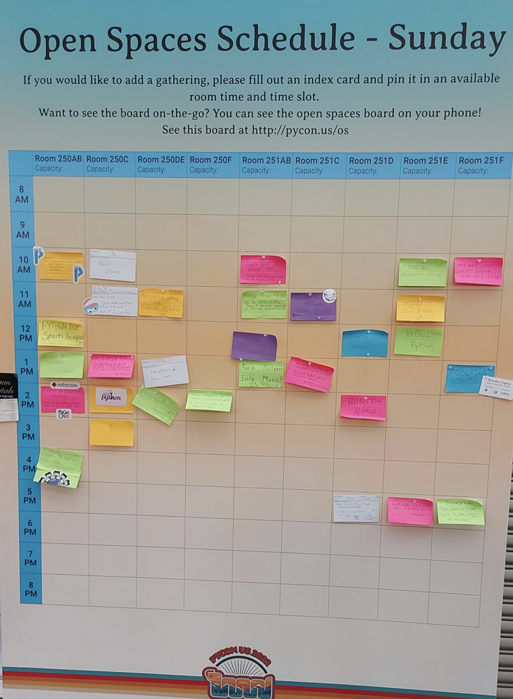

# My First PyCon

One of my 2022 resolutions was to present a talk at a conference. I got my chance when my talk about serialization was accepted to PyCon 2022. Note: PyCon expects all attendees to pay for their conference ticket. However, there are travel grant opportunities that can cover airfare, hotel costs, and ticket costs. In my case, I did receive a PyCon travel grant for my airfare and hotel. My employer (AWS) reimbursed me for my ticket.

## Tutorials
I signed up for a tutorial on [Fairlearn](https://github.com/fairlearn). It was a cool introduction to a new (to me) library. I had originally signed up for another tutorial on Privacy-Preserving Computation, but unfortunately it was canceled.

## Open Spaces
Open Spaces were a new concept for me, but (as others had advised me) one of the better parts of the conference for me. There's a big billboard where anyone can post a topic. Like-minded folks meet and chat about that topic. I attended several, including Pandas and Python for Security, but there were some for board games, cooking, and the newly-announced [PyScript](https://pyscript.net). If you go, I concur with the oft-heard device to prioritize attending open spaces. They're one element of the conference that you can only get in-person and in realtime.

## Talks
I attended lots of talks, but also didn't feel much pressure because I knew that they would all be posted on YouTube later. Here is a list of some of my favorites:

[Building a Binary Extension](https://youtu.be/gROGDQakzas)

[Demystifying Python's Internals](https://youtu.be/HYKGZunmF50)

[hooking into the Import System](https://youtu.be/ziC_DlabFto)

[Python for Threat Intelligence](https://youtu.be/Zf38qncahiU)

and there were some that I missed due to conflicts (either with other talks or the open spaces mentioned above). I'm looking forward to watching them. And of course, there was [my talk about serialization formats](https://youtu.be/ygrjAGDU1J8).

## Social
There was great food readily available at meal times and the atmosphere at PyCon was very social. I got to chat with core devs, a data scientist from Sweden (I hope his mountain bike trip to Moab was awesome), and a startup founder. There was also the expo hall with swag-a-plenty.

## Conclusion
PyCon was a great experience. I learned things that I'll use on hobby projects, and for both my data and security skills. I recommend it for both new and experienced Pythonistas. It wasn't cheap, but if cost is the barrier preventing you from going, look into their grant program. I'd also encourage everyone to submit talks. Attendees have a wide range of interests and skill levels and PyCon accepts talks that appeal to all of them. You don't need to present cutting edge research. Think of a problem you encountered and solved recently and go for it!
