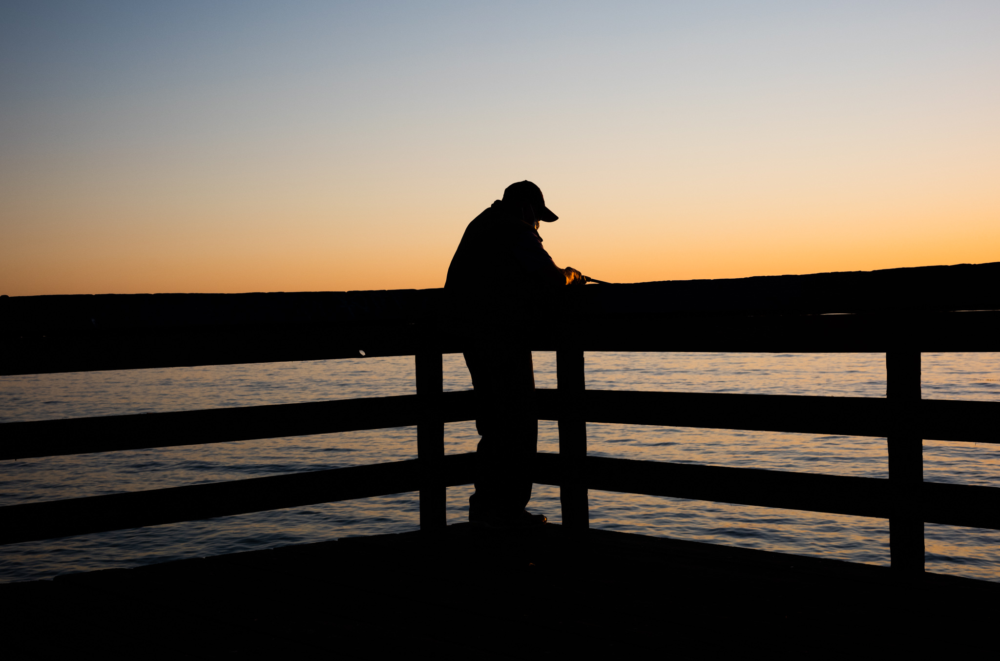
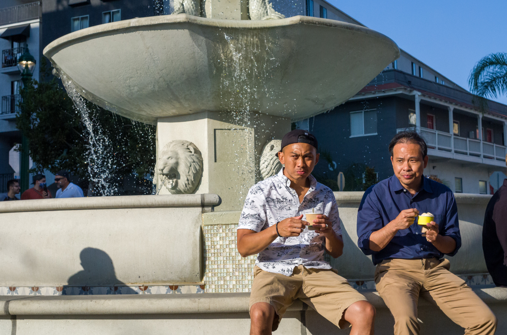
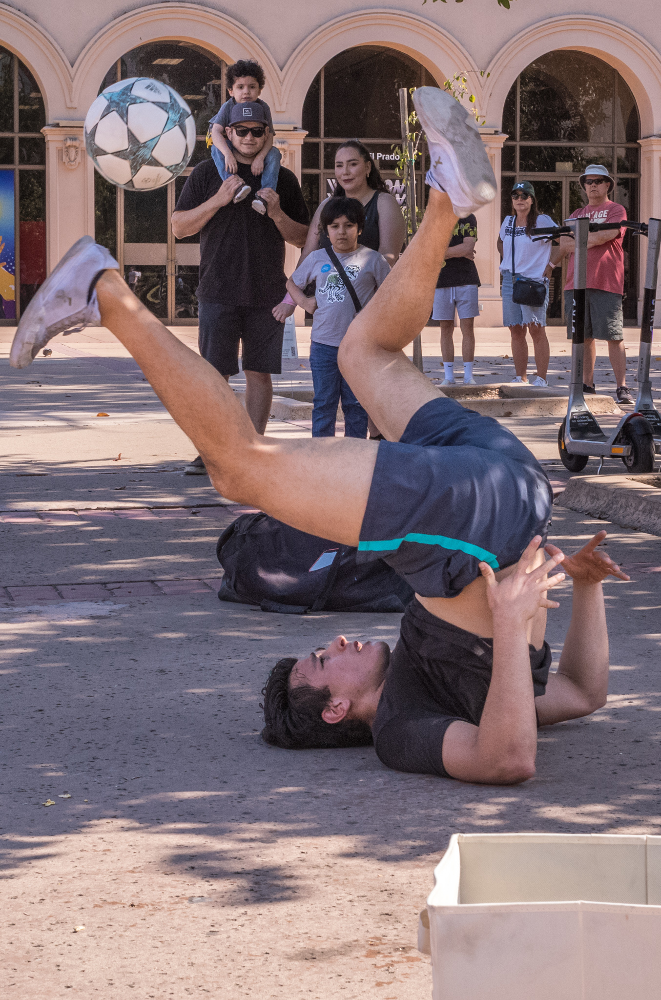
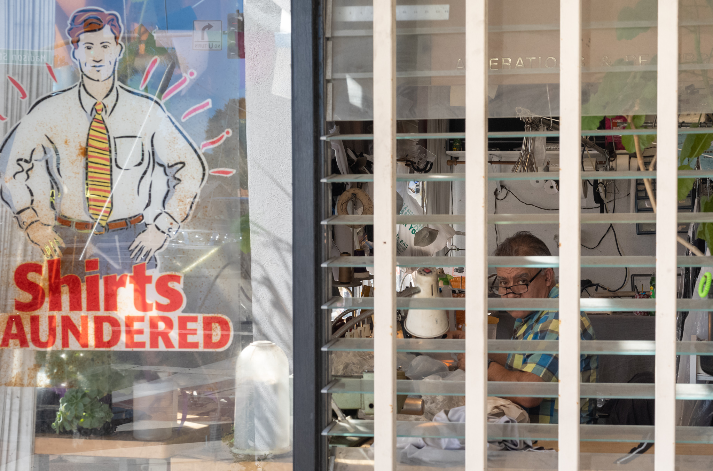
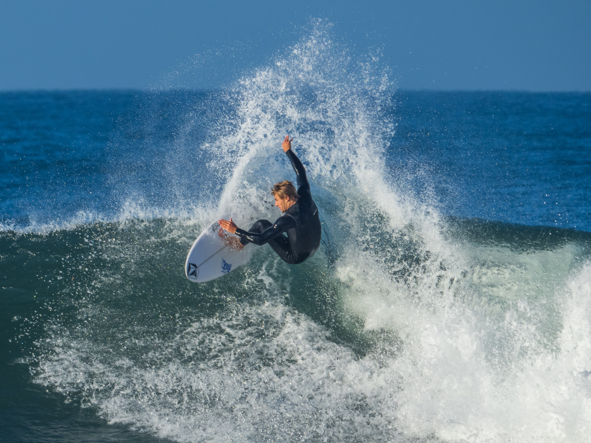
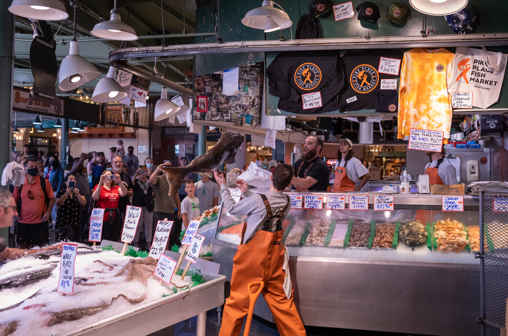
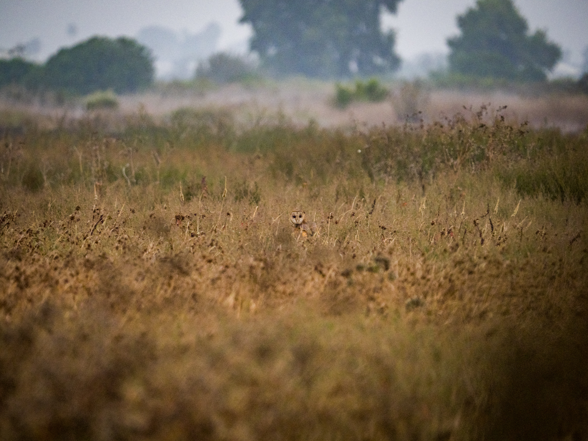
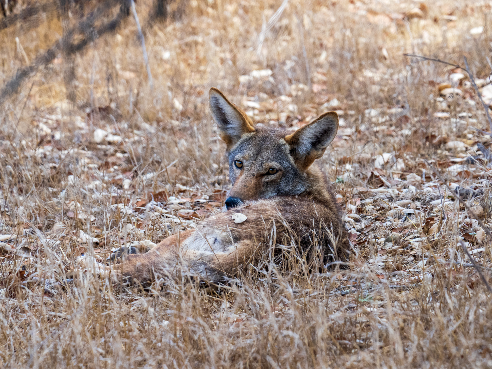
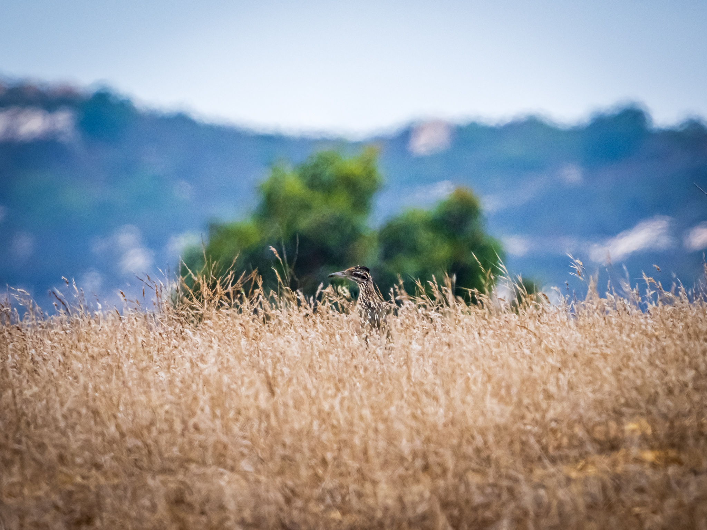

# Photography

My quarantine hobby was photography. I experimented, but gravitated towards the genre of street and nature photography. Here are some that I'm particularly proud of.

October 2021. Taken at the [Imperial Beach Pier](https://www.portofsandiego.org/wonderfront/discover-imperial-beach-pier). I like how the gradient of the sunset meets the water at the railing.

August 2021. Taken in [Little Italy, San Diego](https://www.littleitalysd.com), you can't convince me that these two gentlemen aren't related.

August 2021. Taken in [Balboa Park](http://www.balboapark.org). This guy was pretty incredible and dripping in sweat as he threw his body into his stunts. He earned every tip he got.

November 2021. Very friendly guy I spoke with on "Small Business Saturday." [Ponto Cleaners](https://www.carlsbad-village.com/go/ponto-cleaners)

September 2021. The first surf competition I ever witnessed. Well, it turns out this guy was actually just a local enjoying the surf before the competition, but he fooled me.

August 2021. Everyone talks about Seattle's flying fish in [Pike Place Market](https://www.pikeplacemarket.org). The tourist attraction isn't without cost though: "When you start buying, the fish start flying."

August 2021. I have some flying shots, but I like the camoflauge demonstrated by this barn owl at the [Tijuana River National Estuarine Research Reserve](https://trnerr.org).

August 2021. Well, you can tell there's no hunting allowed at the [Ramona Grasslands](https://www.sdparks.org/content/sdparks/en/park-pages/RamonaGrasslands.html). In the heat of the day, this lazy pooch was 20 yards away.

August 2021. Another [Ramona Grasslands](https://www.sdparks.org/content/sdparks/en/park-pages/RamonaGrasslands.html) capture. This was my first day seeing roadrunners and I liked the layered colors of this composition.
