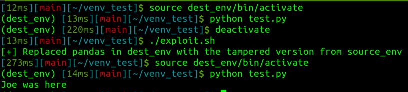
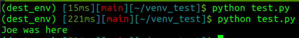

# venv Injection

## Background

We do a lot of assumed breach operations and I believe it's the best way to get some defense in depth wins. Especially from an AI Red Team perspective, I spend a lot of time thinking about how to modify training-time artifacts to subtly manipulate the derivative model or system. In the past, I focused on the potential to [inject into a user's Jupyter runtime](https://josephtlucas.github.io/blog/content/jupyter.html) to modify in-memory artifacts (which has matured into a module in [V'ger](https://github.com/JosephTLucas/vger)). My favorite go-to example is overwriting dataloaders or datasets to functionally poison training without modifying the files on disk.

On many of these operations, we see a score of various virtual environments laying around. We've often thought about the potential impact of swapping or modifying some of these dependencies on disk to change the behavior of code later executed in that virtual environment. I figured it was probably possible, but [here's the POC](https://github.com/JosephTLucas/venv-injection) verifying it to myself.

## Mechanic

There isn't much too it. If you build the library in the right environment for the target, you can do a 1:1 swap into the target venv `site-packages`. I think there are also often modifications you could do in-place (like this modification to Pandas), but for many libraries and things you may want to inject, you'll rely on compiled objects and may just want to swap the directories.

I also confirmed to myself that it still works if the environment stays activated (it's the time of import that really matters).

## Application

Why? Developers innately trust code they write and objects they push. By modifying an imported dependency, there will be no noticeable change in their code base, nothing pushed to remote repositories, and you can impact artifacts before any integrity controls are applied (like signatures).

You could do something as simple as fixing a random seed or changing remote URLs, or add data exfiltration methods, or very tailored effects like modifying activation functions or library-provided models and architectures prior to transfer learning.

## Mitigations

There are several simple mitigations against this technique, but besides prevention, the most obvious mitigation is to have any production asset built in a CI/CD pipeline that references a known-good artifact repository. In that case, while this tampering would impact researchers and developers, it would be caught during this gold-image build when metrics or other tests fail.
