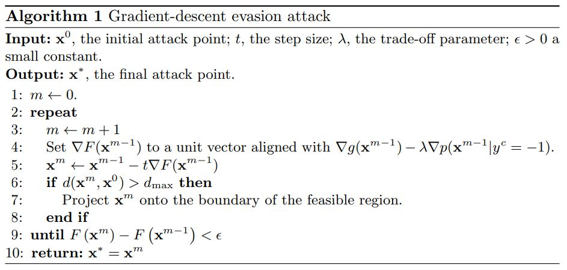

# Notes for Adversarial Machine Learning Reading List

Notes to accompany [this AML reading list](https://nicholas.carlini.com/writing/2018/adversarial-machine-learning-reading-list.html).

## Preliminary Papers

### [Evasion Attacks Against Machine Learning at Test Time](https://arxiv.org/pdf/1708.06131.pdf)

**Important contributions:**  
Mimicry -- imitate features of known legitimate samples  
Kernel Density Estimation -- favor attacks in densely populated regions  

> classical performance evaluation techniques are not suitable to reliably assess the security of learning algorithms, i.e. the performance degradation caused by carefully crafted attacks.

This expands the definition of performance from accuracy metrics to runtime behavior.

> Proactive Protection
> 1. Find vulnerabilities
> 2. Investigate impact of corresponding attacks
> 3. Devise appropriate countermeasures

What other best practices can we borrow from traditional information security? A taxonomy for vulnerabilities, vulnerability management programs, semver and patching.

How reliably can we identify vulnerabilities without proof-of-concept exploits?

How often are countermeasures changes to the core model (hard/expensive) vs ETL steps (easier)?

> Two approaches have previously addressed security issues in learning. The min-max approach assumes the learner and attacker’s loss functions are antagonistic, which yields relatively simple optimization problems. A more general game-theoretic approach applies for non-antagonistic losses; e.g., a spam filter wants to accurately identify legitimate email while a spammer seeks to boost his spam’s appeal. Under certain conditions, such problems can be solved using a Nash equilibrium approach. Both approaches provide a secure counterpart to their respective learning problems; i.e., an optimal anticipatory classifier.

> Our approach is applicable to any classifier with a differentiable discriminant function.

> The adversary can transform attack points in the test data but must remain within a maximum distance of dmax from the original attack sample. We use dmax to simulate increasingly pessimistic attack scenarios by giving the adversary greater freedom to alter the data.

> The choice of a suitable distance measure is application specific.... should reflect the adversary's effort required to manipulate samples or the cost of these manipulations.

Creating a malicious sample is generally a non-linear optimization problem (gradient descent, Newton's method, BFGS, L-BFGS).

> Locally optimizing `g(x)` with gradient descent is particularly susceptible to failure due to the nature of a discriminant function.... may lead into unsupported regions.

We don't know how our adversarial sample will be classified in these regions.

> The attacker should favor attack points from densely populated regions of legitimate points.

> ... favors attack points that imitate features of known legitimate samples. In doing so, it reshapes the objective function and thereby biases the resulting gradient descent towards regions where the negative class is concentrated.... similar to _mimicry_ attacks in network intrusion detection.

> if `g` is non-differentiable or sufficiently smooth, one may still use the mimicry/KDE term of Eq 2 as a search heuristic.

> In discrete spaces, gradient approaches travel through infeasible portions of the feature space. In such cases, we need to find a feasible neighbor...

> Mimicry (lambda) may allow us to trade for a higher probably of evading the target classifier at the expense of a higher number of modifications.

> The PDF structure imposes natural constraints on attacks. Although it is difficult to remove an embedded object, it is rather easy to insert new objects.

I didn't know that; pretty interesting natural constraint.

> ... [in the limited knowledge case, we limited the number of samples] to demonstrate that even with a dataset as small as 20% of the original training set size, the adversary may be able to evade the targeted classifier with high reliability.

> It is worth noting that attacking a linear classifier amounts to always incrementing the value of the highest weighted feature until it reaches its upper bound. This continues with the next highest weighted non-bounded feature until termination.

> the RBF SVM provides a higher degree of security compared to linear SVMs.... interestingly, compared to SVMs, neural networks seem to be much more robust against the proposed evasion attack. This behavior can be explained by observing that the decision function in neural networks may be characterized by flat regions. Hence, the gradient descent algorithm sops after a few attack iterations for most malicious samples without being able to find a suitable attack.

> mimicking exhibits some beneficial aspects for the attacker, although the constraint on feature addition may make it difficult to properly mimic legitimate samples.

Canaries for alerting on illegitimate samples to detect ongoing adversarial tests?

> We believe the proposed attack formulation can be extended to classifiers with non-differentiable discriminant functions as well, such as decision trees and k-nearest neighbors by defining suitable search heuristics similar to our mimicry term.

### [Intriguing properties of neural networks](https://arxiv.org/pdf/1312.6199.pdf)

**Important contributions:**  
1. The smoothness assumption underlying many kernel methods does not hold.
2. It's the space, not the units, that hold the semantic representation
3. Adversarial examples may generalize between networks and training sets -> transferability

> While their expressiveness is the reason they succeed, it also causes them to learn uninterpretable solutions that could have counter-intuitive properties

> First, we find there is no distinction between individual high level units and random linear combinations of high level units. It is the space, rather than the individual units, that contain the semantic information in the high layers of neural networks.

> DNN learn mappings that are fairly discontinuous... the specific nature of these perturbations is not a random artifact of learning: the same perturbation can cause a different network, that was trained on a different subset of data, to misclassify the same input.

> adversarial examples are relatively robust, and are shared by neural networks with varied number of layers, actions or trained on different subsets of training data... if we use one neural net to generate a set of adversarial examples, we find tha tthese examples are still statistically hard for another neural network even if it was trained differently

> adversarial examples represent low-probability high-dimensional pockets in the manifold which are hard to efficiently find by simply randomly sampling the input around a given example.

training-time deformations are inefficient and static through the entire training of the model

> _hard negative mining_: identifying training examples which are given low probabilities by the model, but which should be high probability instead. The training set distribution is changed to emphasize these hard negatives

> For all networks we studied, for each sample, we have always managed to generate very close, visually hard to distinguish, adversarial examples

What's the real world impact here? What confidence intervals/SLAs can we provide to customers?

> adversarial examples are somewhat universal and not just he results of overfitting to a particular model

> back-feeding adversarial examples to training might improve generalization

> adversarial examples for the higher layers seemed to be significantly more useful than those on the input or lower layers

> regularization of the parameters, consisting of penalizing each upper Lipschitz bound, might help improve the generalization error of the networks

### [Explaining and Harnessing Adversarial Examples](https://arxiv.org/pdf/1412.6572.pdf)

## Attacks

### [The Limitations of Deep Learning in Adversarial Settings](https://arxiv.org/pdf/1511.07528.pdf)

**Important contributions:**  
General algo for modifying samples -> Use the forward derivative to generate the adversarial saliency map

> instead of using these gradients to update network parameters as would normally be done, gradients are used to update the original input itself, which is subsequently misclassified

> we craft adversarial samples by constructing a mapping from input perturbations to output variations

> _forward derivative_: the Jacobian (all first order partial derivatives necessary for bach prop) of the function learned by the DNN... the forward derivative is used to construct adversarial saliency maps

> forward derivatives are applicable in supervised and unsupervised systems

I hadn't thought about test-time distinctions between these two target classes. Are the resulting classifiers fundamentally different?

> _fooling image_: image with no source class that gets classified with high confidence in a targeted attack

> knowledge of the architecture and weight parameters is sufficient to derive adversarial samples against acyclic feedforward DNNs

> small input perturbations found using the forward derivative can induce large variations in the output

> not all regions from the input domain are conducive to find adversarial samples and the forward derivative reduces the adversarial sample search space.

This attack algorithm is still iterative... "repeat until misclassification or maximum distortion reached" -> noisy

> the distortion introduced by reducing pixel intensities seems harder to detect by the human eye

> humans still correctly classify adversarial samples crafted with a distortion smaller than 14.29%

> removing pixels reduces the information entropy... greater absolute values of intensity variations are more confidently misclassified by the DNN

### [DeepFool: a simple and accurate method to fool deep neural networks](https://arxiv.org/pdf/1511.04599.pdf)

### [Towards Evaluating the Robustness of Neural Networks](https://arxiv.org/pdf/1608.04644.pdf)

**Important Contributions:**
1. Three new attacks not mitigated by defensive distillation -> proposes these attacks as a baseline

> three new attack algorithms that are successful on both distilled and undistilled NN with 100% probability

> _defensive distillation_: reduces existing attacks from 95% to 0.5%. Can be applied to any feed-forward NN and only requires a single re-training step. Replace softmax with a smoothed softmax. Use this to generate "soft training labels" which are used in the second iteration.

> Adversarial generation algos available @ http://nicholas.carlini.com/code/nn_robust_attacks -> https://github.com/carlini/nn_robust_attacks

Paper has a nice threat model section

> Three different approaches for choosing a target class: average case (select from uniform), best case (class that was least difficult to attack), worst case (class that was hardest to attack)

Paper has an interesting discussion about distance metrics (L0 - number of changes, L2 - euclidean distance, Linf - maximum budget)

> adversarial examples exist is not due to blind spots in a highly non-linear neural network, but due only to the locally-linear nature of neural networks. -> linearity hypothesis

> Fast Gradient sign is designed to be fast, not optimal... iterative gradient sign was found to produce superior results

> DeepFool is untargeted and optimized on L2... produces closer adversarial examples than L-BFGS
