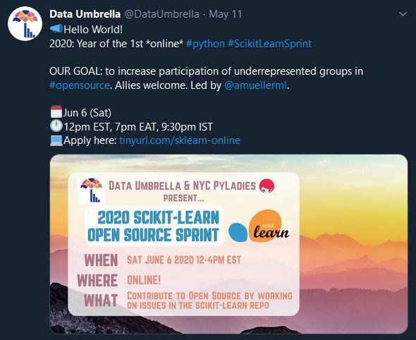
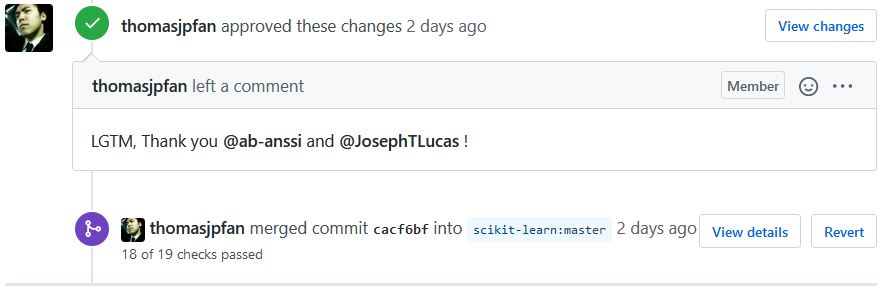
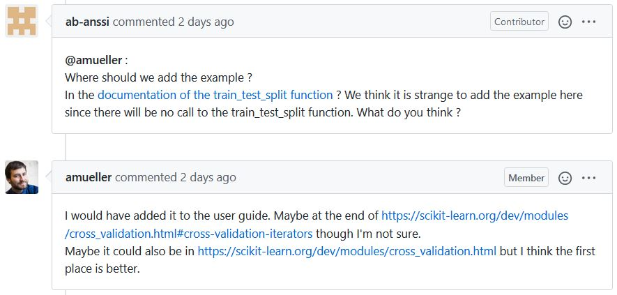
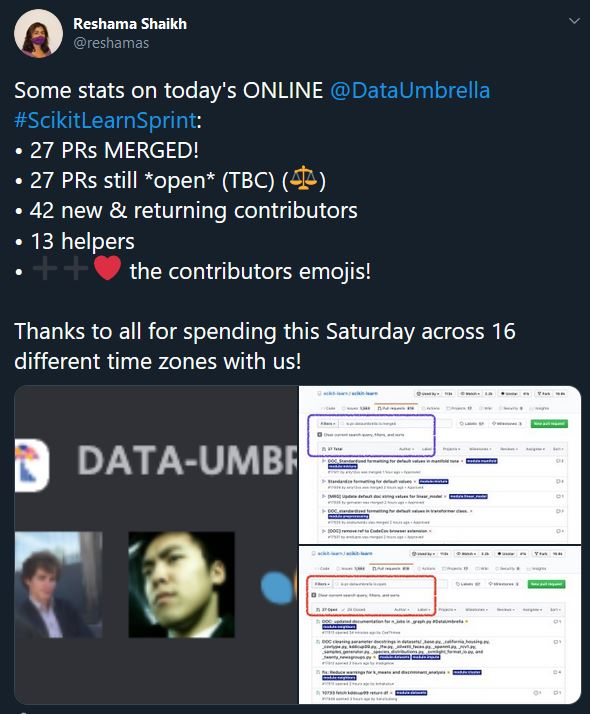

# Scikit-Learn Sprint

Continuing on my Open Source Adventure, yesterday I spent 4 hours working with 40 other Open Source Aspirants to contribute to the popular machine learning library, Scikit-Learn as part of the [Data Umbrella + NYC PyLadies Scikit-Learn Open Source Sprint](https://sites.google.com/view/nyc-2020-scikit-sprint).  It was a phenomenal experience and I would like to cover some of the highlights and encourage you to seek similar opportunities in the future.

Data Umbrella is a relatively young organization dedicated to "providing a welcoming and educational space for under-represented persons in the fields of ML/DS/AI" and NYC PyLadies is a "group for Python ladies and non-binary people of all levels of programming experience in the NYC metro area."  Together, these great organizations got together with the Scikit-Learn maintainers and organized this great one-day event to help under-represented people and allies learn how to contribute to open source.

**Lesson 1:  Be on Twitter.**  My partner (more about this later) and I both heard about this event through Twitter.  There are incredibly helpful and active data science/machine learning and Python communities on Twitter.  It is the best way to find out about conferences, events, or engage with the movers and shakers.

After seeing a Tweet about the event, I had to apply.  As you will see, this event was very personal and the Scikit-Learn maintainers were incredibly available and responsive (not something to take for granted).  To ensure this valuable educational resource was used wisely, the Sprint organizers did do some screening.

**Lesson 2:  Be engaged, honest, and responsible.** In my application, I talked about my long-standing goal of contributing to open source.  I also made it clear that I see the data science and python communities as just that, communities.  As a member of the community, I not only wanted to participate, but I wanted to continue improving the community and making it more accessible and inclusive for under-represented people.  Finally, I made sure that I would be available to participate.  I would not waste a slot for another candidate.  This was a Saturday commitment.

A couple of the days before the Sprint started, the organizers sent out preparatory material.  This included things like the communication plan, and some short introductions to [Scikit-Learn](https://scikit-learn.org/stable/) and Github.  I made sure to knock out these little assignments before the event, so I could maximize my productivity during the Sprint.  The material was very accessible, and new programmers and scientists will be able to follow along.

The first key part of what made the Sprint so accessible was that the organizers and maintainers curated a list of open issues that they thought may be accessible to new contributors.  Often, large open source repositories have some issues tagged as `good first issue` or `easy`, which are good indicators.  In this case, the maintainers greatly reduced that set, increasing the accessibility of the project for us.  The night before the Sprint, I looked through this list, selecting a couple issues that I thought I might be able to handle.

**Lesson 3:  Do your homework.**  The Sprint will go faster than you think.  The more prepared you are (by understanding version control with git, making sure your programming environment is working, and having a rough idea of what you want to work on), the more productive your Sprint experience will be.  That being said, if this all seems daunting, do not worry, there will be a lot of helpful people who can get you setup on game day.

On the day of the Sprint, we started the day with a little virtual huddle, then it was off to the races!  It was cool to just hang out with the Scikit-Learn maintainers on Discord before everything started.  We got to talk a little bit about design decisions and philosophies.  That sort of thing is sometimes hard to get without an experience like this Sprint.  The second key part of what made the Sprint so accessible was the commitment to pair programming.  Each participant was assigned to a table with another participant.  You agree on an issue with your partner and spend the day working on it together.  This was my first time pair programming and it made the experience so much more educational for me!  I was the more junior member on my team, so most of the day I was sharing my screen while my partner and I talked about what we should do.  My partner and I spent the whole 4 hours on voice chat with each other.  Saying that now, it sounds like a lot, but it really felt very natural.  There were also some unintended benefits of screen sharing.  I started out programming in VS Code, but we joked about how my partner was "hard core" and used vi.  I have always been interested in vi and struggled to "stick with it", but halfway through the day I switched over and my partner taught me some awesome new tips.  I am writing this blog in vi now!

I am on the East Coast of the US.  My partner was located in Paris.  How cool is that?  We spent the first couple of minutes getting to know each other, and I was excited to learn that my partner had already made several contributions to Scikit-Learn.  Additionally, we shared several similar work experiences.  It is incredible how you can build relationships and community remotely around the ideals and experience of open source software contribution.

**Lesson 4:  It is about more than code.**  I was originally interested in open source because I wanted to "give back", but what has kept me interested is the sense of being able to continue learning and growing in a community.

The first issue my partner and I decided to tackle was changing a function to handle optional keyword arguments.  That seemed like a feasible way to start understanding the library.  It turned out that the function we picked was really a convenience wrapper to another function.  The python here was easy, but it was a confidence boost to build the source code and pass all of the unit tests.  I also was able to continue building good habits around version control (write good commit messages).  I will highlight a key difference in this Sprint from contributing to Open Source any other time: *The maintainers reviewed our pull request and approved it within minutes.*  It was great to receive such immediate feedback.  As a hobby-pythonista, it was also very educational to see how a huge project like Scikit-Learn organizes its code, documentation, tests, and continuous integration pipeline.

**Lesson 5:  There is more to a codebase than the intended functionality.**  Scikit-Learn is a machine learning library, but you do not need to know anything about machine learning to successfully contribute.  Many of the open issues involved updating documentation, or in our case, updating how function parameters are passed.

With such a quick win under our belt, my partner and I set off to find another issue.  It was quite fun and encouraging to see so much activity on the issue tracker; many of the issues we visited were already claimed by fellow sprint participants.  Eventually, my partner and I found an issue that looked interesting.

This was a new `feature request`.  Someone who used Scikit-Learn wanted to add an optional argument.  As we read through the issue tracker, we saw that one of the maintainers (who was participating in the Sprint!) proposed another way of achieving that functionality without changing the underlying function (by using another function instead).  The issue was changed to `documentation` to reflect that instead of changing the code, Scikit-Learn could clarify their documentation to illustrate this alternative approach.  Now here is the key: this conversation was *years* old and had taken months of back and forth.  My partner and I deliberated about where to put the documentation, then just asked the maintainer!  They immediately responded, but we realized there was some nuance that we were not ready to solve, so we left a comment in the issue and decided we were not going to work on it during the Sprint.  Feel free to go check out the [issue](https://github.com/scikit-learn/scikit-learn/issues/9193) and see what you think should be done.

**Lesson 6:  The codebase and issues outlive the Sprint.**  While we had the luxury of direct access to one of the core developers through Discord, we were jumping into an ongoing discussion that lasted years and would continue after the Sprint.  To contribute to the historical record for future contributors, we added our relevant discussion to the `open issue`, not just leaving it in the Sprint Discord channel.

By this point, we had about two hours left and my partner and I felt like being ambitious.  We found an open issue that proposed enabling bootstrapping at the tree-level in forest classifiers and regressors to decrease training time.  Here was an opportunity to contribute to the functionality of this cool data science library; very exciting!  We spent the next two hours researching how the code works currently and how we might implement this new feature.  We prototyped a toy example and.... it failed!  We trouble-shooted and... it still failed.  As time ticked down on the Sprint, we could not figure out why.  So we submitted a `work in progress` pull-request and called it a successful day.  We agreed that we had enjoyed working together and would continue working on this issue even after the Sprint ended.

**Lesson 7:  The Sprint is just the beginning.**  While it is an awesome event, the Sprint is just one day.  The goal is that it jump-starts your ability to contribute to Open Source.  With that perspective, I am almost glad that may partner and I left that one issue unfinished.  The Sprint gave us a great foundation to get started and now we will be able to continue to work and finish that feature request on our own.  A new friend and a foothold in a fun new project, what more can you ask for?

As I look back on the event, I am amazed at what we were able to do in 4 hours:  we strengthened our sense of community and contributed to one of my favorite python libraries.  Personally, I learned more about SciKit-Learn, Open Source workflows, python, git, and even vi.  I would like to thank the maintainers and core developers for all of their time before, during, and after the event.  You were all incredibly cool, approachable, and helpful.  I would also like to thank the organizers and volunteers from [Data Umbrella](https://www.dataumbrella.org) and [NYC PyLadies](https://www.meetup.com/NYC-PyLadies/), especially [Reshama Shaikh](https://reshamas.github.io/), the primary organizer.  I appreciate your flexibility and willingness to hold the event remotely.  I probably would not have been able to participate otherwise.  This was a great event that I recommend to all open source aspirants.  I am looking forward to continuing my open source adventure and continuing to strengthen and open the python and data science communities.

