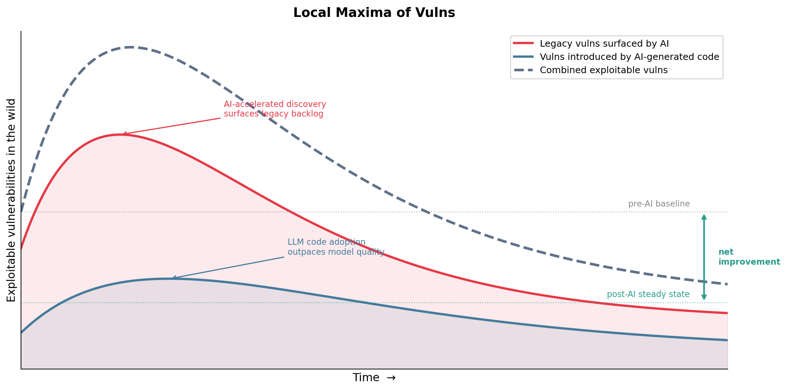
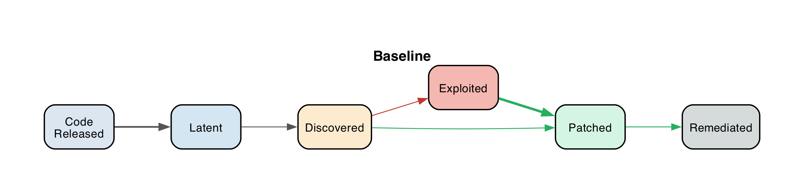
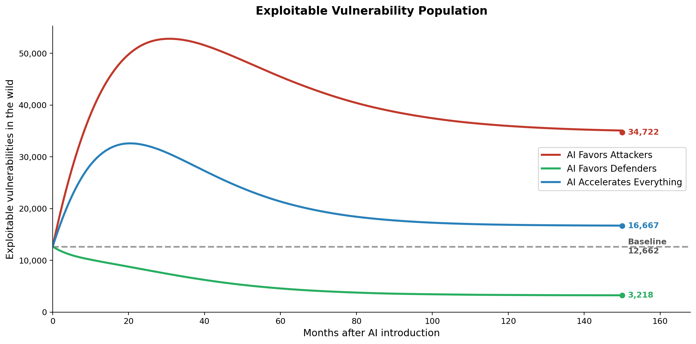

# Modeling Vulnerability Density post-AI

Someone\* framed the current wave of AI-enabled vulnerability discovery as “decades of accumulated tech debt coming due at once.” I’m also seeing a fair number of vulnerabilities introduced in AI-generated code, although I expect that to decrease. This led me to wonder about the future steady-state of exploitable vulnerabilities. Each of those two factors may create local maxima, but would also necessarily decrease… the vulns would be found, (optionally) exploited, and patched. The pace of AI would enable us to pay down the tech debt while models improved sufficiently to create fewer bugs.



My friend Jacob Baxter framed the future state of exploitation as a [predator-prey problem](https://en.wikipedia.org/wiki/Lotka%E2%80%93Volterra_equations). The rabbits (vulns) “reproduce” at a certain rate and are eaten (exploited) at a certain rate. Or maybe getting eaten is getting patched… either way, they’re consumed and taken off the board. The rates of vuln production and consumption can inform the population dynamics of the rabbits. That’s what I’m interested in… what is the future density of vulnerabilities?

Another way to think about it is as a [Markov Chain](https://en.wikipedia.org/wiki/Markov_chain). There’s a queue of software creation/input leading to vulnerability states \[latent, discovered, exploited, patched, and remediated\]. 



AI will inherently change the state change rates. How it influences each has significant implications for the future density of vulnerabilities.



I’m just trying to think about rates and convergence here, the numbers don’t matter significantly and I didn't check them at all, but for the curious, this is what Claude used when I was creating the data viz.

```
λ (creation/arrival rate):
  ~130 CVEs disclosed per day in 2025 ≈ 3,900/month
  Source: NVD data, Indusface 2026 report, Zafran Research
  Note: This is *disclosed* vulns. Actual creation rate is higher
  since many sit latent for years. We use disclosed as a proxy.

α (discovery rate — Latent → Discovered):
  RAND "Zero Days, Thousands of Nights" (2017): average zero-day
  lifespan is 6.9 years before public disclosure. Collision rate
  ~5.7%/year. → α ≈ 1/(6.9*12) ≈ 0.012/month.
  Synopsys (2024): average open source vuln is 2.5 years old at
  discovery → α ≈ 1/30 ≈ 0.033/month.
  USENIX (Alexopoulos et al., 2022): vulnerability lifetimes
  follow exponential distribution, vary significantly by project.
  ➤ Baseline: α ≈ 0.02/month (split the difference, ~4yr avg latency)

β (exploit development rate — Discovered → Exploited):
  Time-to-exploit (TTE) for vulns that ARE exploited:
    2018: 63 days (Mandiant/GTIG)
    2023: 32 days (Mandiant)
    2024: 5 days  (Mandiant, Fortinet)
    2025: -7 days (Mandiant M-Trends 2026 — exploited before disclosure)
  But only ~0.5% of CVEs are ever exploited in the wild:
    CISA KEV: 1,484 total entries vs 320,000+ total CVEs ever.
    2025: 244 KEV additions vs ~48,000 CVEs disclosed.
  The model captures this via the β vs γ race:
    P(exploited) = β/(β+γ). If ~0.5% get exploited and γ ≈ 0.017,
    then β ≈ 0.00009. But that's for ALL vulns; for vulns that
    attract attacker attention, the rate is much higher.
  ➤ Baseline: β ≈ 0.005/month
    (represents the average across all vulns, most of which
    nobody tries to exploit — weighted by the small fraction
    that are high-value targets)

γ (patch creation rate — Discovered → Patched):
  Verizon DBIR (2024): 55 days to patch 50% of critical vulns.
  Indusface (2026): average time to remediate critical vuln > 60 days.
  Veracode: average time to patch exceeds 100 days.
  ➤ Baseline: γ ≈ 0.017/month (≈ 60 day median to patch creation)
  Note: this is time to WRITE the patch, not deploy it.

δ (emergency patch rate — Exploited → Patched):
  Help Net Security (2025): KEV vulns resolved in median 174 days.
  But: once actively exploited, emergency response is faster.
  CISA BOD 22-01 mandates KEV remediation within 14 days for
  critical internet-facing vulns.
  ➤ Baseline: δ ≈ 0.07/month (≈ 14 days for actively exploited vulns)
  This is faster than γ because exploitation triggers incident response.

ε (deployment/remediation rate — Patched → Remediated):
  Recorded Future (2026): median time to close half of internet-facing
  vulns is ~361 days across all orgs.
  By sector: Utilities ~270 days, Healthcare ~519 days, Education ~577 days.
  Even KEV vulns: >60% remediated after CISA deadline (Help Net Security).
  ➤ Baseline: ε ≈ 0.005/month (≈ 200 days — the deployment bottleneck)
  This is the slowest rate in the system, and it's organizational,
  not technical. AI doesn't fix change management.
"""


# ═══════════════════════════════════════════════════════════════════════════
# Data-grounded scenarios
# ═══════════════════════════════════════════════════════════════════════════

scenarios = {
    "Baseline": {
        # Grounded in public data (see docstring above)
        "lambda": 3900,    # CVEs/month (NVD 2025: ~130/day)
        "alpha":  0.02,    # ~4 year avg latency (RAND/Synopsys)
        "beta":   0.005,   # low — most vulns never exploited
        "gamma":  0.017,   # ~60 day median patch time (Verizon/Indusface)
        "delta":  0.07,    # ~14 days for actively exploited (CISA BOD)
        "epsilon": 0.005,  # ~200 day deployment lag (Recorded Future)
    },
    "AI Favors Attackers": {
        "lambda": 5000,    # +28%: more AI-generated code, more vulns
        "alpha":  0.06,    # 3×: AI fuzzing accelerates discovery
        "beta":   0.025,   # 5×: LLM-assisted exploit dev (IBM: 87% success rate w/ CVE descriptions)
        "gamma":  0.020,   # modest improvement in patch speed
        "delta":  0.08,    # slight improvement in emergency response
        "epsilon": 0.005,  # unchanged — organizational bottleneck
    },
    "AI Favors Defenders": {
        "lambda": 3500,    # -10%: AI code review catches bugs at authoring time
        "alpha":  0.06,    # 3×: same discovery boost (benefits both sides)
        "beta":   0.008,   # modest increase in exploit dev
        "gamma":  0.05,    # 3×: AI-assisted patch generation
        "delta":  0.15,    # 2×: AI-powered incident response
        "epsilon": 0.008,  # slight improvement via automated deployment
    },
    "AI Accelerates Everything": {
        "lambda": 5000,    # more code shipped
        "alpha":  0.08,    # 4×: discovery way up
        "beta":   0.02,    # 4×: exploit dev much faster
        "gamma":  0.04,    # 2.5×: patching faster but not as fast
        "delta":  0.10,    # emergency response improves
        "epsilon": 0.005,  # deployment bottleneck remains
    },
}
```

I’d love to hear any other analysis/speculation about what the future density of exploitable vulnerabilities is going to be.

\*sorry, I lost the reference. Happy to attribute the framing if you contact me.
